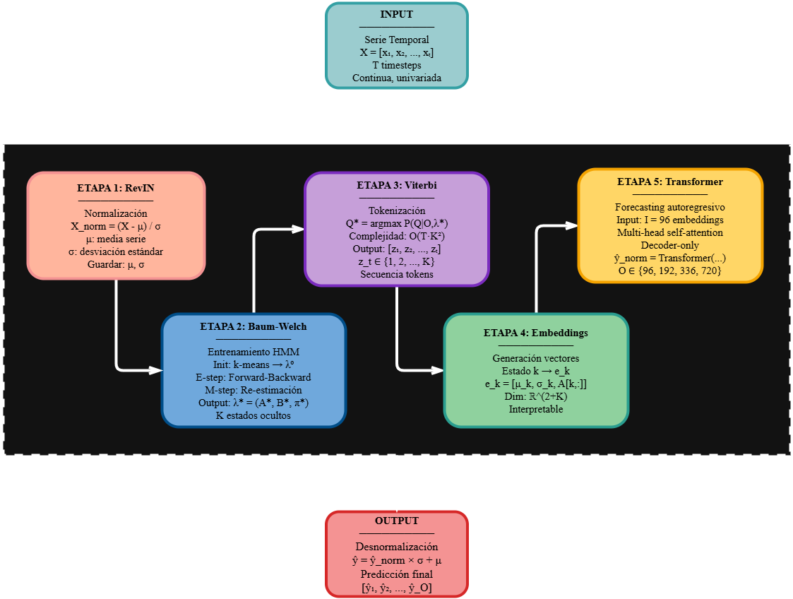

# RITMO

**Regimenes latentes mediante Inferencia Temporal con Markov Oculto**

Tokenizacion de series temporales mediante Hidden Markov Models y evaluacion frente a tecnicas deterministas actuales.

Trabajo de Fin de Grado — Business Analytics, Universidad Francisco de Vitoria.

Autor: Jaime Oriol Goicoechea

## Objetivo

Implementar un sistema de tokenizacion probabilistica basado en HMM donde los estados ocultos actuen como embeddings latentes con significado estadistico explicito (media, volatilidad, probabilidades de transicion), y comparar su desempeno predictivo frente a cinco tecnicas de tokenizacion consolidadas y cuatro modelos baseline del estado del arte.

## Pipeline RITMO

<p align="center">

</p>

```
Serie temporal --> RevIN --> Baum-Welch --> Viterbi --> Embeddings --> Transformer --> Prediccion
```

1. **RevIN**: normalizacion reversible por instancia (Kim et al., 2022).
2. **Baum-Welch**: entrenamiento HMM con K estados y emisiones gaussianas.
3. **Viterbi / Forward-Backward**: asignacion de estados (hard, soft, soft-residual).
4. **Embeddings**: e_k = [mu_k, sigma_k, A[k,:]] — vector interpretable por estado.
5. **Transformer**: prediccion sobre embeddings estructurados + desnormalizacion.

## Estructura del repositorio

```
RITMO/
├── hmm/                     # Modulo HMM propio
│   ├── baum_welch.py        #   Entrenamiento EM
│   ├── viterbi.py           #   Decodificacion optima
│   ├── forward_backward.py  #   Probabilidades a posteriori
│   ├── gaussian_emissions.py#   Emisiones gaussianas
│   ├── checkpoint.py        #   Guardado/carga de parametros
│   └── utils.py             #   log-normalize, init k-means
│
├── embeddings/              # Generacion de embeddings
│   ├── embedding_generator.py  # e_k = [mu_k, sigma_k, A[k,:]]
│   └── technique_embeddings.py # Embeddings para las 6 tecnicas
│
├── tecnicas/                # 6 tecnicas de tokenizacion
│   ├── discretization.py    #   SAX (Lin et al., 2007)
│   ├── text_based.py        #   LLMTime (Gruver et al., 2023)
│   ├── patching.py          #   PatchTST (Nie et al., 2023)
│   ├── decomposition.py     #   Autoformer (Wu et al., 2021)
│   ├── foundation.py        #   MOMENT (Goswami et al., 2024)
│   ├── metrics.py           #   Metricas intrinsecas de tokenizacion
│   ├── ETTh2_tokenization.ipynb       # Visualizaciones ETTh2
│   ├── Electricity_tokenization.ipynb # Visualizaciones Electricity
│   ├── comparacion_metricas.ipynb     # Comparacion metricas intrinsecas
│   └── figures/             #   Figuras exportadas
│
├── models/                  # Modelos
│   ├── TransformerCommon.py #   Backbone comun Plan A
│   ├── DLinear.py           #   Baseline (Zeng et al., 2023)
│   ├── PatchTST.py          #   Baseline (Nie et al., 2023)
│   ├── TimeMixer.py         #   Baseline (S. Wang et al., 2024)
│   └── TimeXer.py           #   Baseline (Y. Wang et al., 2024)
│
├── layers/                  # Componentes de red compartidos
├── exp/                     # Clases de experimentacion
│   ├── exp_plan_a.py        #   Experimentos Plan A (6 tecnicas)
│   └── exp_long_term_forecasting.py  # Experimentos Plan B
├── data_provider/           # Carga y procesamiento de datos
├── utils/                   # Metricas, herramientas, timefeatures
│
├── notebooks/               # Notebooks de experimentacion
│   ├── pipeline_RITMO_etth2.ipynb       # Validacion 4 fases del pipeline
│   ├── train_hmm_k.ipynb               # Entrenamiento HMM un K
│   ├── train_hmm_multi_k.ipynb          # Entrenamiento HMM K={5,10,15,20}
│   ├── train_hmm_multi_k_weather.ipynb  # Entrenamiento HMM Weather
│   ├── test_todas_tecnicas.ipynb        # Plan A: 8 tecnicas ETTh1
│   └── test_todas_tecnicas_weather.ipynb# Plan A: 8 tecnicas Weather
│
├── scripts/                 # Scripts de ejecucion
│   ├── plan_a/              #   Scripts Plan A
│   └── long_term_forecast/  #   Scripts Plan B (baselines)
│
├── cache/                   # Parametros HMM entrenados (.pth)
├── results/                 # Metricas y predicciones (.npy)
├── test_results/            # Graficas de predicciones (.pdf)
│
├── referencias/             # PDFs de papers organizados (no trackeado)
│   ├── 1-Tecnicas/          #   Discretizacion, Patching, Decomp, FModels, Text
│   ├── 2-Transformer-Baselines/  # Informer, TimesNet, TimeMixer, TimeXer
│   ├── 3-Surveys/           #   Surveys LLMs + TS
│   ├── 4-Preprocesamiento/  #   RevIN, Non-stationary Transformers
│   ├── 5-HMM/               #   Rabiner, Hamilton, Baum-Welch, sticky HDP-HMM
│   ├── 6-Datasets/          #   Accuracy Law, Long-Short patterns
│   └── 7-Evaluacion-token/  #   Metricas de evaluacion de tokenizacion
│
├── run.py                   # Script principal de ejecucion
├── environment.yml          # Entorno Conda (usar este)
└── pic/                     # Imagenes del README
```

## Instalacion

Requisitos: Python 3.10, Conda.

```bash
conda env create -f environment.yml
conda activate ritmo
```

Verificacion:

```bash
python -c "import torch; print(torch.__version__)"
python -c "from hmm import baum_welch, viterbi_decode; print('HMM OK')"
python -c "from models import DLinear, PatchTST, TimeMixer, TimeXer; print('Modelos OK')"
```

## Datasets

Descargar desde [Google Drive](https://drive.google.com/drive/folders/13Cg1KYOlzM5C7K8gK8NfC-F3EYxkM3D2?usp=sharing) y colocar en `./dataset/`.

| Dataset | Dominio | Frecuencia | Observaciones | Rol |
|---------|---------|------------|---------------|-----|
| ETTh1 | Energia | Horaria | 17.420 | Entrenamiento HMM |
| ETTh2 | Energia | Horaria | 17.420 | Entrenamiento HMM |
| Weather | Meteorologia | 10 min | 52.696 | Entrenamiento HMM |
| Electricity | Energia | Horaria | 26.304 | Entrenamiento HMM |
| Traffic | Transporte | Horaria | 17.544 | Zero-shot |
| Exchange | Finanzas | Diaria | 7.588 | Zero-shot |

## Uso

### Plan A: comparacion controlada de 6 tecnicas

Ejecutar desde notebooks (recomendado):

```bash
jupyter notebook notebooks/test_todas_tecnicas.ipynb
```

O via script:

```bash
python run.py \
  --model TransformerCommon \
  --data ETTh1 \
  --task_name plan_a \
  --tokenization_technique hmm_K5 \
  --seq_len 96 --pred_len 96 \
  --features S
```

Tecnicas disponibles: `discretization`, `text_based`, `patching`, `decomposition`, `foundation`, `hmm_K5`, `hmm_soft`, `hmm_soft_residual`.

### Plan B: baselines del estado del arte

```bash
bash scripts/long_term_forecast/ETT_script/PatchTST_ETTh1.sh
bash scripts/long_term_forecast/ETT_script/DLinear_ETTh1.sh
bash scripts/long_term_forecast/ETT_script/TimeMixer_ETTh1.sh
```

### Validacion del pipeline HMM

```bash
jupyter notebook notebooks/pipeline_RITMO_etth2.ipynb
```

### Entrenamiento HMM con multiples K

```bash
jupyter notebook notebooks/train_hmm_multi_k.ipynb
```

## Configuracion experimental

- Input: I = 96 timesteps
- Horizontes: O = {96, 192, 336, 720}
- Metricas: MSE, MAE
- Modo: features S (univariado puro)
- Protocolo: TSLib estandar (Zhou et al., 2021)

## Base de codigo

Construido sobre [Time-Series-Library](https://github.com/thuml/Time-Series-Library) (TSLib, THUML). Los modulos `hmm/`, `embeddings/`, `tecnicas/` y `models/TransformerCommon.py` son implementacion propia del TFG.
