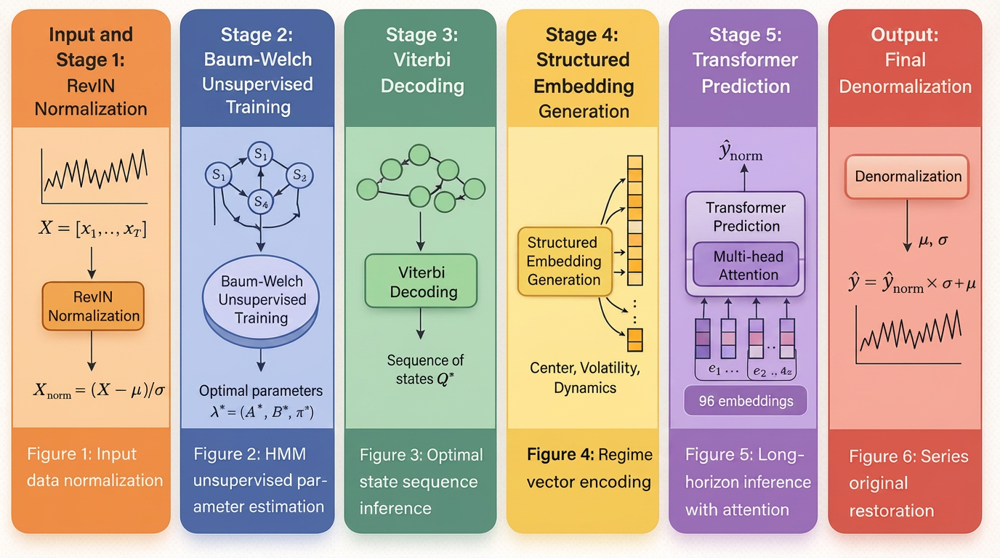

# RITMO

### When does probabilistic tokenization help? Interpretable Hidden Markov regime embeddings for long-term time series forecasting

This repository contains the code, configurations and trained HMM caches behind the paper. It lets you reproduce the controlled tokenization study (Plan A), the comparison against state-of-the-art forecasters (Plan B), and the figures.

**Authors:** Jaime Oriol¹, Julio E. Sandubete¹,² (corresponding), Ana Lazcano¹

> ¹ Universidad Francisco de Vitoria, Pozuelo de Alarcón, Madrid, Spain
> ² CRIA-BDHS Research Group, Universidad Camilo José Cela, Madrid, Spain
> Corresponding author: Julio E. Sandubete — je.sandubete@ufv.es
> ORCID: J. E. Sandubete [0000-0002-1518-0417] · A. Lazcano [0000-0002-6492-0012]

## Abstract

Tokenization has become a central design choice in transformer-based time series forecasting, yet most existing tokenizers convert continuous observations into symbols, patches, decomposed components, or masked segments without assigning probabilistic structure to the token itself. We study tokenization as a representation-learning stage for neural forecasting and ask how the input representation conditions what a transformer can learn. We propose Hidden Markov Models (HMMs) as an interpretable probabilistic tokenizer that maps each observation to a regime-based embedding built from Gaussian emission parameters and transition probabilities, so that every token coordinate retains statistical meaning. To isolate this effect, six tokenization mechanisms (quantile discretization, character serialization, fixed-length patching, trend–seasonal decomposition, foundation-inspired masked patching, and HMM-based tokenization) are integrated into one shared transformer backbone with reversible instance normalization, on four benchmark datasets, four horizons and three seeds. Beyond downstream MSE and MAE, we evaluate intrinsic representation properties (reconstruction error, autocorrelation retention, entropy, persistence, and perturbation stability) and link them to forecasting behavior. HMM tokenization is not universally superior, but becomes competitive when latent regimes are temporally persistent, statistically well separated, or robust to distribution shift, ranking first on Weather and ETTh2, while decomposition and patch-based tokenizers remain preferable for smooth-trend or multi-scale cyclic series. A frozen-tokenizer cross-domain experiment shows that regime transfer succeeds only when source and target dynamics are structurally aligned. Rather than claiming universal superiority, the study contributes an interpretable probabilistic representation, an explicit characterization of when regime-based tokenization helps, and evidence on when such representations transfer across domains.

*Keywords:* time series tokenization; transformer forecasting; Hidden Markov Models; regime embeddings; long-term forecasting; representation learning.

## What this work proposes

RITMO (Regime Inference via Temporal Markov Observation) treats the hidden states of an HMM as tokens. Each state `k` becomes an interpretable embedding

```
e_k = [ mu_k , sigma_k , A[k,:] ]
```

that concatenates the regime center (`mu_k`), its volatility (`sigma_k`), and its transition probabilities to the other states (`A[k,:]`). Unlike the latent vectors of foundation models or the raw values of patching, every coordinate has a concrete statistical meaning, and the transition matrix puts temporal dynamics inside the token rather than delegating it entirely to the transformer.

The study integrates six tokenizers into a single fixed transformer so that any difference in error is attributable to the representation, not the architecture. Three HMM embedding variants are considered: `hard` (Viterbi assignment), `soft` (gamma posteriors), and `soft-residual` (soft posteriors plus the intra-regime residual `(x - mu)/sigma`).

## Pipeline

<p align="center">
  
</p>

```
Series x --> RevIN --> HMM (Baum-Welch, K states) --> Viterbi / Forward-Backward
                          |
                          v
                   Structured embeddings [mu_k, sigma_k, A[k,:]]
                          |
                          v
                   Transformer encoder (fixed architecture)
                          |
                          v
                   Inverse RevIN --> Prediction y_hat
```

1. **RevIN** — reversible per-instance normalization, applied before the HMM and inverted after the forecast (Kim et al., 2022).
2. **Baum-Welch** — HMM training with `K` states and Gaussian emissions, k-means initialization and EM until the log-likelihood converges (epsilon = 1e-4).
3. **Viterbi / Forward-Backward** — hard state assignment or soft gamma posteriors.
4. **Embeddings** — per-state `e_k` and its variants, in `embeddings/embedding_generator.py`.
5. **Transformer** — a fixed encoder shared by all tokenizers, in `models/TransformerCommon.py`.

## Main findings

HMM tokenization is competitive, not universally best. In the controlled comparison (Plan A) it ranks first in average MSE on Weather and ETTh2, beats the SAX-inspired baseline on three of the four datasets, and stays within a narrow band of the best baseline on the rest. Against full state-of-the-art models (Plan B) it never ranks first, but it beats DLinear on all four datasets and beats all four baselines at the longest horizon (720) on ETTh2.

The empirical rule that summarizes when it helps: regime-based tokenization is competitive when the series has temporally persistent, well-separated regimes (Weather), or when it tolerates distribution shift through relative regimes (ETTh2). Decomposition and patching remain preferable for smooth-trend or multi-scale cyclic series (ETTh1, Electricity). The frozen-tokenizer cross-domain experiment confirms the rule: transfer succeeds on Exchange (shift) and fails on Traffic (misaligned regimes).

Full tables, statistical tests and figures are in the paper.

## Installation

Requirements: Python 3.10, Conda.

```bash
conda env create -f environment.yml
conda activate ritmo
python -c "from hmm import baum_welch, viterbi_decode; print('HMM OK')"
python -c "from embeddings import EmbeddingGenerator; print('Embeddings OK')"
python -c "from models import TransformerCommon, DLinear, PatchTST; print('Models OK')"
```

## Datasets

Six standard TSLib benchmarks. Download from [Google Drive](https://drive.google.com/drive/folders/13Cg1KYOlzM5C7K8gK8NfC-F3EYxkM3D2?usp=sharing) and place under `./dataset/`.

| Dataset | Domain | Frequency | Observations | Role |
|---------|--------|-----------|--------------|------|
| ETTh1 | Energy | Hourly | 17,420 | HMM training |
| ETTh2 | Energy | Hourly | 17,420 | HMM training |
| Weather | Meteorology | 10 min | 52,696 | HMM training |
| Electricity | Energy | Hourly | 26,304 | HMM training |
| Traffic | Transport | Hourly | 17,544 | Cross-domain transfer |
| Exchange | Finance | Daily | 7,588 | Cross-domain transfer |

## Reproducing the experiments

### Train an HMM cache

```python
from hmm import baum_welch
from hmm.checkpoint import save_hmm_params
import pandas as pd, numpy as np

df = pd.read_csv('dataset/ETT-small/ETTh1.csv')
obs = df['OT'].values.astype(np.float64)
obs_norm = (obs - obs.mean()) / obs.std()

result = baum_welch(obs_norm, K=5, max_iter=100, epsilon=1e-4)
save_hmm_params(result, 'cache/hmm_etth1_K5.pth')
```

### Plan A — controlled tokenization comparison

```bash
python run.py \
  --task_name plan_a \
  --is_training 1 \
  --root_path ./dataset/ETT-small/ --data_path ETTh1.csv \
  --model_id ETTh1_96_96 --model TransformerCommon --data ETTh1 \
  --features S --seq_len 96 --pred_len 96 \
  --enc_in 1 --dec_in 1 --c_out 1 \
  --d_model 64 --n_heads 4 --e_layers 2 --d_ff 128 \
  --dropout 0.1 --batch_size 32 \
  --learning_rate 0.001 --lradj cosine --train_epochs 30 --patience 7 \
  --technique hmm_soft_residual --hmm_k 5 \
  --des plan_a_hmm_soft_res_K5 --itr 1
```

Tokenizers available via `--technique`:

- Deterministic: `discretization`, `text_based`, `patching`, `decomposition`, `foundation`
- HMM: `hmm` (hard Viterbi), `hmm_soft`, `hmm_soft_residual`, `hmm_augmented`, `hmm_split`, `hmm_patched`

The full multi-seed pipeline (k-sweep, in-domain, cross-domain, intrinsic metrics) is orchestrated from `scripts/paper1/`.

### Plan B — state-of-the-art baselines

```bash
bash scripts/long_term_forecast/ETT_script/PatchTST_ETTh1.sh
bash scripts/long_term_forecast/ETT_script/DLinear_ETTh1.sh
bash scripts/long_term_forecast/ETT_script/TimeMixer.sh
```

RITMO-M (the multivariate, channel-independent variant) is run from `scripts/plan_b/`.

### Notebooks

```bash
jupyter notebook notebooks/pipeline_RITMO_etth2.ipynb     # pipeline validation
jupyter notebook notebooks/paper1_runner.ipynb            # launch paper experiments
jupyter notebook notebooks/paper1_final_results.ipynb     # downstream aggregation
jupyter notebook notebooks/paper1_figures.ipynb           # paper figures
```

## Experimental configuration

- Input length: I = 96 timesteps; horizons O = {96, 192, 336, 720}.
- Metrics: MSE and MAE (RMSE/MAPE/MSPE also stored).
- Plan A: `features S` (univariate, `OT` column), three seeds {42, 2021, 7}, paired Wilcoxon test with Bonferroni correction.
- Plan B: `features M` with channel-independence, single seed (2021), descriptive comparison.
- Fixed transformer: `d_model=64, n_heads=4, e_layers=2, d_ff=128, dropout=0.1`; Adam, `lr=1e-3`, cosine annealing, 30 epochs, patience 7, batch 32.
- Splits: 7:1:2 (TSLib convention).

## HMM embedding variants

Implemented in `embeddings/embedding_generator.py`:

| Variant | Input | Formula | Notes |
|---------|-------|---------|-------|
| `hmm` | Viterbi states | `e_k = [mu_k, sigma_k, A[k,:]]` | Hard baseline; discrete bottleneck |
| `hmm_soft` | gamma [T,K] | `gamma @ embedding_table` | Wins on shift-dominated series (ETT) |
| `hmm_soft_residual` | gamma + x | `[r_t, mu_soft, sigma_soft, A_soft]`, `r_t=(x-mu)/sigma` | Wins on persistent regimes (Weather) |
| `hmm_augmented` | gamma + x | `[x_t, gamma_t]` | HMM enriches rather than replaces |
| `hmm_split` | gamma + x | separate Linear for x and gamma + LayerNorm | Decomposition ablation |
| `hmm_patched` | gamma + x | patches of `[x, gamma]` | Combines HMM and patching |

## Implementation notes

The HMM module is a custom NumPy implementation. Forward-backward and Viterbi are vectorized (Python loops removed), with a batched `forward_backward_batch()` that processes `[B, T]` in a single call. The vectorized routines were checked bit-for-bit against a naive reference (T=8640, K=5, diff = 0.0). Trained parameters are cached so experiments are exactly reproducible.

## Repository structure

```
RITMO/
├── hmm/                  # Custom vectorized HMM (Baum-Welch, forward-backward, Viterbi)
├── embeddings/           # Structured embeddings and the 6 HMM variants
├── tecnicas/             # 5 deterministic tokenizers + intrinsic metrics
├── models/               # TransformerCommon (fixed) + DLinear/PatchTST/TimeMixer/TimeXer
├── layers/               # Shared blocks (RevIN, encoder, attention, decomposition)
├── exp/                  # Plan A / Plan B / SOTA experiment loops
├── data_provider/        # Loaders for the six datasets
├── utils/                # Metrics, training tools, time features
├── notebooks/            # Pipeline validation, EDA, paper figures
├── scripts/
│   ├── paper1/           # 6-phase multi-seed pipeline (Plan A)
│   ├── plan_b/           # Multivariate RITMO-M sweep
│   └── long_term_forecast/  # SOTA baseline scripts
├── cache/                # Trained HMM parameter caches
├── results/              # Per-experiment metrics
├── run.py                # Unified entry point
└── environment.yml       # Conda environment
```

> `dataset/`, `md/`, `memoria/` and environment artifacts are excluded via `.gitignore`.

## Citation

```bibtex
@article{oriol2026ritmo,
  title   = {When does probabilistic tokenization help? Interpretable Hidden
             Markov regime embeddings for long-term time series forecasting},
  author  = {Oriol, Jaime and Sandubete, Julio E. and Lazcano, Ana},
  year    = {2026}
}
```

## Codebase

Built on top of [Time-Series-Library](https://github.com/thuml/Time-Series-Library) (THUML). The `hmm/`, `embeddings/`, `tecnicas/`, `exp/exp_plan_a.py` and `models/TransformerCommon.py` modules are original to this work. The baselines (DLinear, PatchTST, TimeMixer, TimeXer) and the `layers/`, `data_provider/`, `utils/` infrastructure come from the original library.

## Key references

- Rabiner, L. R. (1989). *A tutorial on hidden Markov models*. Proc. IEEE 77(2).
- Kim, T. et al. (2022). *Reversible instance normalization for accurate time-series forecasting*. ICLR.
- Nie, Y. et al. (2023). *A time series is worth 64 words (PatchTST)*. ICLR.
- Zeng, A. et al. (2023). *Are transformers effective for time series forecasting? (DLinear)*. AAAI.
- Wu, H. et al. (2022). *Autoformer: decomposition transformers with auto-correlation*. NeurIPS.
- Wang, S. et al. (2024). *TimeMixer: decomposable multiscale mixing*. ICLR.
- Wang, Y. et al. (2024). *TimeXer: empowering transformers with exogenous variables*. NeurIPS.
- Gruver, N. et al. (2024). *Large language models are zero-shot time series forecasters (LLMTime)*. NeurIPS.
- Goswami, M. et al. (2024). *MOMENT: a family of open time-series foundation models*. ICML.
- Lin, J. et al. (2007). *Experiencing SAX: a novel symbolic representation of time series*. DMKD.
```
