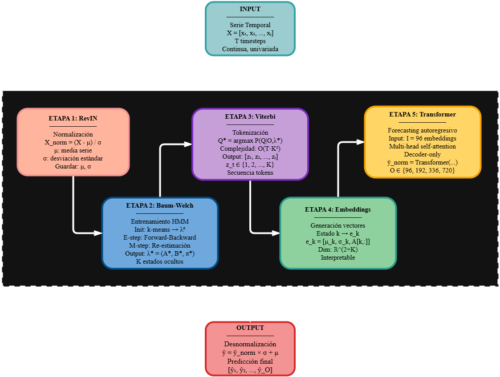

# RITMO

**Regimenes latentes mediante Inferencia Temporal con Markov Oculto**

Tokenizacion de series temporales mediante Hidden Markov Models y evaluacion frente a tecnicas deterministas actuales (patching, decomposition, foundation models) bajo una arquitectura Transformer compartida.

Trabajo de Fin de Grado — Business Analytics, Universidad Francisco de Vitoria.

Autor: Jaime Oriol Goicoechea.

## Pregunta de investigacion

¿Pueden los estados ocultos de un HMM actuar como embeddings latentes estructurados que capturen regimenes estadisticos de forma mas efectiva que las tecnicas deterministicas actuales de tokenizacion para prediccion de series temporales univariadas?

## Contribucion

1. **HMM como tokenizador probabilistico**: los estados ocultos se proyectan a embeddings `e_k = [mu_k, sigma_k, A[k,:]]` interpretables (centro del regimen, volatilidad, dinamicas de transicion).
2. **Seis variantes de embedding HMM**: hard (Viterbi), soft (gamma posteriors), soft-residual (residual intra-regimen), augmented, split, patched.
3. **Marco de comparacion controlado (Plan A)**: mismo Transformer, misma normalizacion RevIN externa, mismos splits, mismo optimizador — solo cambia la tokenizacion.
4. **Implementacion HMM propia y vectorizada**: Baum-Welch, forward-backward batch y Viterbi en NumPy con eliminacion de loops Python (verificado bit-a-bit vs referencia naive, diff=0.0).

## Pipeline RITMO

<p align="center">

</p>

```
Serie x --> RevIN --> HMM (Baum-Welch, K estados) --> Viterbi / Forward-Backward
                           |
                           v
                    Embeddings estructurados [mu_k, sigma_k, A[k,:]]
                           |
                           v
                    Transformer encoder (arquitectura fija)
                           |
                           v
                    RevIN inverso --> Prediccion y_hat
```

1. **RevIN**: normalizacion reversible por instancia, externa y compartida (Kim et al., 2022).
2. **Baum-Welch**: entrenamiento HMM con K estados y emisiones gaussianas. Inicializacion k-means + EM hasta convergencia (log-likelihood, epsilon=1e-4).
3. **Viterbi / Forward-Backward**: asignacion hard o posteriors gamma soft.
4. **Embeddings**: e_k por estado + variantes (soft, soft-residual, augmented, split, patched) en `embeddings/embedding_generator.py`.
5. **Transformer**: encoder con arquitectura FIJA comun a todas las tecnicas (`models/TransformerCommon.py`).

## Resultados principales

Comparacion justa Plan A (misma config `d_model=64, n_heads=4, e_layers=2, d_ff=128`, cosine LR, 30 epochs):

**Weather, pred_len=96 — HMM gana a todas las baselines:**

| # | Tecnica | MSE | MAE |
|---|---------|-----|-----|
| 1 | **hmm_soft K=8** | **0.001200** | **0.0254** |
| 2 | hmm_soft K=5 | 0.001276 | 0.0263 |
| 3 | foundation | 0.001302 | 0.0262 |
| 4 | decomposition | 0.001309 | 0.0266 |
| 5 | patching | 0.001314 | 0.0262 |

HMM supera a patching en **-8.7%** MSE. El optimo K=8 es un sweet spot claro (K=5,6,7,9,10,12 todas peores).

**ETTh1, ETTh2 y otros horizontes (resumen):**

| Dataset | Horizonte | Mejor HMM | MSE HMM | Mejor baseline | MSE baseline | Gap |
|---------|-----------|-----------|---------|----------------|--------------|-----|
| Weather | 96  | hmm_soft K=8        | 0.00120 | patching | 0.00131 | **-8.7%** |
| ETTh2   | 96  | hmm_soft_res K=5    | 0.1475  | patching | 0.1459  | +1.1% |
| ETTh1   | 96  | hmm_soft_res K=5    | 0.0583  | patching | 0.0560  | +4.2% |
| ETTh1   | 192 | hmm_soft K=5        | 0.0762  | foundation | 0.0743 | +2.6% |
| ETTh1   | 336 | hmm_soft K=5        | 0.0882  | foundation | 0.0855 | +3.2% |

En los 5 escenarios, HMM supera siempre a discretization y text_based. En horizontes largos (pl=192, pl=336) HMM supera a decomposition.

## Estructura del repositorio

> Nota: `dataset/`, `md/`, `memoria/` y artefactos de entorno (`__pycache__/`, `.ipynb_checkpoints/`, `.venv/`, IDE configs) quedan fuera del repo via `.gitignore`.

```
RITMO/
├── hmm/                           # Modulo HMM (implementacion propia, vectorizada)
│   ├── __init__.py
│   ├── baum_welch.py              #   Entrenamiento EM con init k-means
│   ├── forward_backward.py        #   Forward-backward + version batch [B,T,K]
│   ├── viterbi.py                 #   Decodificacion Viterbi + version batch
│   ├── gaussian_emissions.py      #   Emisiones gaussianas en log-space
│   ├── checkpoint.py              #   save_hmm_params / load_hmm_params
│   └── utils.py                   #   log_normalize, initialize_kmeans, LOG_EPS
│
├── embeddings/                    # Generacion de embeddings desde HMM
│   ├── __init__.py
│   ├── embedding_generator.py     #   6 variantes: hard, soft, soft_residual,
│   │                              #                augmented, split, patched
│   └── technique_embeddings.py    #   Embeddings para tecnicas baseline
│
├── tecnicas/                      # 5 tecnicas de tokenizacion deterministas
│   ├── __init__.py
│   ├── discretization.py          #   SAX (Lin et al., 2007)
│   ├── text_based.py              #   LLMTime (Gruver et al., 2023)
│   ├── patching.py                #   PatchTST (Nie et al., 2023)
│   ├── decomposition.py           #   Autoformer/DLinear (Wu et al., 2021)
│   ├── foundation.py              #   MOMENT (Goswami et al., 2024)
│   └── metrics.py                 #   Metricas intrinsecas de tokenizacion
│
├── models/                        # Backbones neuronales
│   ├── __init__.py
│   ├── TransformerCommon.py       #   Backbone compartido Plan A (FIJO)
│   ├── DLinear.py                 #   Baseline (Zeng et al., 2023)
│   ├── PatchTST.py                #   Baseline (Nie et al., 2023)
│   ├── TimeMixer.py               #   Baseline (S. Wang et al., 2024)
│   └── TimeXer.py                 #   Baseline (Y. Wang et al., 2024)
│
├── layers/                        # Componentes de red compartidos
│   ├── __init__.py
│   ├── StandardNorm.py            #   RevIN (Kim et al., 2022)
│   ├── Transformer_EncDec.py      #   Encoder / EncoderLayer
│   ├── SelfAttention_Family.py    #   FullAttention, AttentionLayer
│   ├── Autoformer_EncDec.py       #   series_decomp, moving_avg
│   └── Embed.py                   #   PatchEmbedding, DataEmbedding_wo_pos, etc.
│
├── exp/                           # Clases de experimentacion
│   ├── __init__.py
│   ├── exp_basic.py               #   Clase base (device, registro de modelos)
│   ├── exp_plan_a.py              #   Plan A / Paper-1: tecnicas vs HMM (univariante)
│   ├── exp_plan_b.py              #   Plan B: HMM-M (multivariante)
│   └── exp_long_term_forecasting.py  # Baselines SOTA
│
├── data_provider/                 # Carga y procesamiento de datos
│   ├── __init__.py
│   ├── data_factory.py            #   Factory: ETTh1/h2, Weather, ECL,
│   │                              #            Traffic, Exchange, custom
│   └── data_loader.py             #   Dataset classes + StandardScaler
│
├── utils/                         # Utilidades generales
│   ├── __init__.py
│   ├── metrics.py                 #   MSE, MAE, RMSE, MAPE, MSPE, CORR
│   ├── tools.py                   #   EarlyStopping, adjust_learning_rate, visual
│   ├── revin.py                   #   RevINNormalizer (alternativa)
│   ├── timefeatures.py            #   Codificacion temporal
│   ├── augmentation.py            #   Data augmentation
│   ├── masking.py                 #   Mascaras para atencion / imputacion
│   ├── dtw_metric.py              #   Dynamic Time Warping
│   └── print_args.py              #   Pretty-print de argumentos
│
├── notebooks/                     # Notebooks de pipeline + Paper-1 + Plan B
│   ├── pipeline_RITMO_etth2.ipynb #   Validacion 4 fases del pipeline
│   ├── eda_datasets.ipynb         #   EDA de los 6 datasets
│   ├── eda_datasets.py            #   Pareja jupytext de eda_datasets.ipynb
│   ├── paper1_runner.ipynb        #   Lanzador fases 2-5 Paper-1
│   ├── paper1_final_results.ipynb #   Agregacion downstream multi-seed (Phase 3)
│   ├── paper1_intrinsic_results.ipynb # Agregacion metricas intrinsecas (Phase 5)
│   ├── paper1_figures.{ipynb,py}  #   Figuras del paper draft
│   ├── k_sweep_plan_b.ipynb       #   K-sweep RITMO-M (HMM multivariante)
│   ├── final_results_plan_b.ipynb #   Plan B vs baselines SOTA in-domain
│   ├── fase{1..4}_*_etth2.svg     #   Figuras pipeline RITMO
│   └── figures_eda/               #   Figuras EDA (.svg)
│
├── scripts/
│   ├── long_term_forecast/        # Baselines SOTA (.sh + wrapper)
│   │   ├── ETT_script/            #   8 .sh (4 baselines x ETTh1/ETTh2)
│   │   ├── ECL_script/            #   4 .sh (4 baselines x Electricity)
│   │   ├── Weather_script/        #   4 .sh
│   │   ├── Traffic_script/        #   3 .sh (cross-domain)
│   │   ├── Exchange_script/       #   1 .sh (cross-domain)
│   │   └── run_all_baselines.py   #   Wrapper resumible (--skip-cross-domain)
│   ├── paper1/                    # Pipeline 6 fases multi-seed
│   │   ├── config.py              #   SEEDS, K_VALUES, DATASETS, hmm_cache_path
│   │   ├── k_optimal.json         #   K optimo por dataset post-Phase 2
│   │   ├── phase1_train_hmm_seeds.py
│   │   ├── phase2_k_sweep_seeds.py
│   │   ├── phase3_plan_a_seeds.py
│   │   ├── phase4_cross_domain_seeds.py
│   │   ├── phase5_intrinsic_metrics.py
│   │   ├── phase6_ablation.py
│   │   └── verify_hmm_convergence.py
│   └── plan_b/                    # HMM multivariante
│       ├── plan_b_config.py
│       ├── train_hmm_caches.py    #   Caches HMM-M
│       └── run_ritmo_sweep.py     #   K-sweep RITMO-M downstream
│
├── cache/                         # 122 caches HMM
│   ├── hmm_{ds}_K{k}_seed{s}.pth  #   Univariante Paper-1 (4 ds x 8 K x 3 seeds)
│   └── hmm_M_{ds}_K{k}.pth        #   Multivariante Plan B
│
├── results/                       # Metricas por experimento (697 dirs)
│   ├── plan_a_*_ksweep_paper1_*_seed*_0/   # Phase 2 (192)
│   ├── plan_a_*_final_paper1_*_seed*_0/    # Phase 3 (288)
│   ├── plan_a_*_crossdom_paper1_*_seed*_0/ # Phase 4 (216)
│   └── paper1_intrinsic/          #   Phase 5 (12 JSONs)
│
├── test_results/                  # PDFs visualizacion por-muestra (gitignored)
├── checkpoints/                   # Pesos Transformer entrenados (gitignored)
├── logs/                          # Logs ejecucion (gitignored)
│
├── tutorial/                      # Tutorial TSLib original (referencia)
│   ├── TimesNet_tutorial.ipynb
│   └── {conv,dataset,fft,result}.png
│
├── pic/                           # Imagenes README
│   ├── Pipeline-RITMO.png
│   └── notebookLM.md
│
├── run.py                         # Entry point principal (CLI unificado TSLib)
├── environment.yml                # Entorno Conda (USAR ESTE)
├── .gitignore
└── README.md
```

## Instalacion

Requisitos: Python 3.10, Conda.

```bash
conda env create -f environment.yml
conda activate ritmo
```

Verificacion:

```bash
python -c "import torch; print(torch.__version__)"
python -c "from hmm import baum_welch, viterbi_decode; print('HMM OK')"
python -c "from embeddings import EmbeddingGenerator; print('Embeddings OK')"
python -c "from models import TransformerCommon, DLinear, PatchTST; print('Modelos OK')"
```

## Datasets

Descargar desde [Google Drive](https://drive.google.com/drive/folders/13Cg1KYOlzM5C7K8gK8NfC-F3EYxkM3D2?usp=sharing) y colocar en `./dataset/`.

| Dataset | Dominio | Frecuencia | Observaciones | Rol |
|---------|---------|------------|---------------|-----|
| ETTh1 | Energia | Horaria | 17.420 | Entrenamiento HMM |
| ETTh2 | Energia | Horaria | 17.420 | Entrenamiento HMM |
| Weather | Meteorologia | 10 min | 52.696 | Entrenamiento HMM |
| Electricity | Energia | Horaria | 26.304 | Entrenamiento HMM |
| Traffic | Transporte | Horaria | 17.544 | Zero-shot |
| Exchange | Finanzas | Diaria | 7.588 | Zero-shot |

## Uso

### 1. Entrenar cache HMM

```python
from hmm import baum_welch
from hmm.checkpoint import save_hmm_params
import pandas as pd, numpy as np

df = pd.read_csv('dataset/ETT-small/ETTh1.csv')
obs = df['OT'].values.astype(np.float64)
obs_norm = (obs - obs.mean()) / obs.std()

result = baum_welch(obs_norm, K=5, max_iter=100, epsilon=1e-4)
save_hmm_params(result, 'cache/hmm_etth1_K5.pth')
```

### 2. Plan A: comparacion controlada

```bash
python run.py \
  --task_name plan_a \
  --is_training 1 \
  --root_path ./dataset/ETT-small/ --data_path ETTh1.csv \
  --model_id ETTh1_96_96 --model TransformerCommon --data ETTh1 \
  --features S --seq_len 96 --pred_len 96 \
  --enc_in 1 --dec_in 1 --c_out 1 \
  --d_model 64 --n_heads 4 --e_layers 2 --d_ff 128 \
  --dropout 0.1 --batch_size 32 \
  --learning_rate 0.001 --lradj cosine --train_epochs 30 --patience 7 \
  --technique hmm_soft_residual --hmm_k 5 \
  --des plan_a_hmm_soft_res_K5 --itr 1
```

Tecnicas disponibles via `--technique`:

- Baselines: `discretization`, `text_based`, `patching`, `decomposition`, `foundation`
- HMM: `hmm` (Viterbi hard), `hmm_soft`, `hmm_soft_residual`, `hmm_augmented`, `hmm_split`, `hmm_patched`

### 3. Plan B: baselines completos del estado del arte

```bash
bash scripts/long_term_forecast/ETT_script/PatchTST_ETTh1.sh
bash scripts/long_term_forecast/ETT_script/DLinear_ETTh1.sh
bash scripts/long_term_forecast/ETT_script/TimeMixer_ETTh1.sh
bash scripts/long_term_forecast/Weather_script/TimeMixer.sh
```

### 4. Validar pipeline y explorar resultados

```bash
jupyter notebook notebooks/pipeline_RITMO_etth2.ipynb     # Validacion 4 fases
jupyter notebook notebooks/paper1_runner.ipynb            # Lanzador fases Paper-1
jupyter notebook notebooks/paper1_final_results.ipynb     # Agregacion downstream
jupyter notebook notebooks/paper1_intrinsic_results.ipynb # Metricas intrinsecas
```

## Configuracion experimental

- Input: I = 96 timesteps
- Horizontes: O = {96, 192, 336, 720}
- Metricas: MSE, MAE (reportadas), RMSE/MAPE/MSPE disponibles
- Modo: `features S` (univariado, columna `OT` en ETT / `MT_320` en ECL)
- Split: 7:1:2 (train/val/test) estilo TSLib
- Config Transformer fija: `d_model=64, n_heads=4, e_layers=2, d_ff=128, dropout=0.1`
- Optimizador: Adam, `lr=1e-3`, cosine annealing
- Epochs: 30, patience: 7, batch_size: 32
- K HMM optimo por dataset: Weather K=8, ETTh1/ETTh2 K=5

## Variantes HMM implementadas

Cada variante en `EmbeddingGenerator` (`embeddings/embedding_generator.py`):

| Variante | Input | Formula | Cuando usar |
|----------|-------|---------|-------------|
| `hmm` | Viterbi states | lookup `e_k = [mu_k, sigma_k, A[k,:]]` | Hard baseline |
| `hmm_soft` | gamma [T,K] | `gamma @ embedding_table` | Regimenes puros (Weather) |
| `hmm_soft_residual` | gamma + x | `[r_t, mu_soft, sigma_soft, A_soft]` con `r_t=(x-mu)/sigma` | Series con alta frecuencia (ETT) |
| `hmm_augmented` | gamma + x | `[x_t, gamma_t]` | HMM enriquece sin reemplazar |
| `hmm_split` | gamma + x | Linear separado x y gamma + LayerNorm | Ablacion de decomposition |
| `hmm_patched` | gamma + x | Parches de `[x, gamma]` proyectados | Combina HMM + patching |

## Optimizaciones

- **Forward-backward vectorizado**: eliminado el loop Python `O(T*K^2)`, ~15x speedup en T=8640.
- **Viterbi vectorizado**: eliminado el loop `O(T*K)`.
- **Forward-backward batch**: `forward_backward_batch()` procesa `[B, T]` en una sola llamada.
- **Verificacion**: diff bit-a-bit vs implementacion naive (T=8640, K=5 → diff=0.0).

## Base de codigo

Construido sobre [Time-Series-Library](https://github.com/thuml/Time-Series-Library) (THUML). Los modulos `hmm/`, `embeddings/`, `tecnicas/`, `exp/exp_plan_a.py` y `models/TransformerCommon.py` son implementacion propia del TFG. Los baselines (DLinear, PatchTST, TimeMixer, TimeXer) y la infraestructura de `layers/`, `data_provider/`, `utils/` vienen del repo original.

## Referencias clave

- Rabiner, L. R. (1989). *A tutorial on hidden Markov models*. Proc. IEEE 77(2).
- Kim, T. et al. (2022). *Reversible instance normalization for accurate time-series forecasting (RevIN)*. ICLR.
- Nie, Y. et al. (2023). *A time series is worth 64 words: long-term forecasting with transformers (PatchTST)*. ICLR.
- Zeng, A. et al. (2023). *Are transformers effective for time series forecasting? (DLinear)*. AAAI.
- Wu, H. et al. (2021). *Autoformer: decomposition transformers with auto-correlation*. NeurIPS.
- Wang, S. et al. (2024). *TimeMixer: decomposable multiscale mixing for time series forecasting*. ICLR.
- Gruver, N. et al. (2023). *Large language models are zero-shot time series forecasters (LLMTime)*. NeurIPS.
- Goswami, M. et al. (2024). *MOMENT: a family of open time-series foundation models*. ICML.
- Lin, J. et al. (2007). *Experiencing SAX: a novel symbolic representation of time series*. DMKD.

PDFs de las referencias bajo `referencias/` (7 categorias, 45+ papers).
